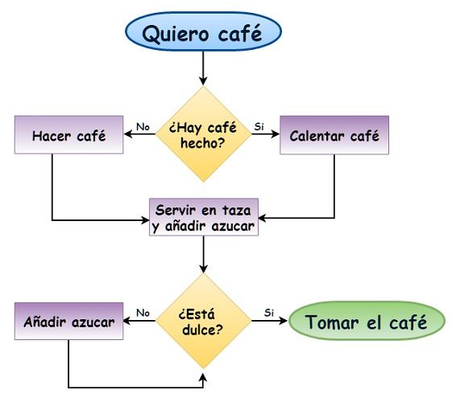
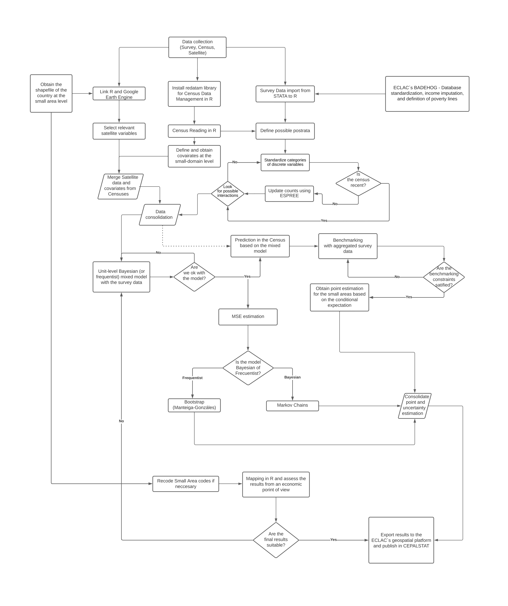

## ¡Descubre la Automatización de Procesos!

**¿Alguna sean han encontrado realizando una tarea repetitiva una y otra vez?** 

\pause

Bueno, permíteme contarles cómo me liberé de esas tareas tediosas. La automatización de procesos nos permite realizar actividades de forma automática, reduciendo al mínimo nuestra intervención. 

## Resolver.  

Suponga la siguiente ecuación: $3x + 2 = 8$. y quieres despejar la incógnita $x$ para encontrar su valor.

1. Paso 1: **Si una cantidad está sumando, pasa restando**.
   \[3x = 8 - 2\]
   Esto simplifica la ecuación a: \(3x = 6\).

2. Paso 2: **Si una cantidad está multiplicando, pasa dividiendo**.
   \[x = \frac{6}{3} \]
   Esto nos da: \(x = 2\).

\pause

Imaginen despejar realizar este proceso una y otra vez, ¡pero ahora con la ayuda de la automatización!

## Acciones que realizas de forma mecánica 

1. Tomarse un café.

2. Conducir un automóvil.

3. Escribir en un teclado.

4. Resolver sistema de ecuaciones lineales. 

5. Realizar análisis estadístico.

6. Calcular integrales definidas. 

## Diagrama de flujo. 

{ width=70% }

## Eficiencia y Creatividad van de la mano

La automatización nos brinda la oportunidad de liberarnos de los procesos repetitivos y mecánicos, permitiéndonos enfocarnos en actividades más creativas y estratégicas. En lugar de perder tiempo en tareas que pueden ser realizadas de manera automática, podemos emplear nuestra energía y talento en áreas que requieren nuestra atención y creatividad.

**¡La automatización es como tener un compañero de trabajo virtual que se encarga de las tareas aburridas mientras nosotros desplegamos nuestra imaginación!**

## Importancia de los indicadores socioeconómicos

Los indicadores socioeconómicos desempeñan un papel crucial en la formulación de políticas y en la evaluación del impacto de las intervenciones. Proporcionan información clave sobre la situación económica y social de un país, así como sobre la efectividad de las políticas implementadas.

## Relevancia de los Objetivos de Desarrollo Sostenible (ODS)

Los ODS establecidos por las Naciones Unidas son una guía global para promover un desarrollo sostenible en todas sus dimensiones. Para monitorear el progreso hacia estos objetivos, es crucial contar con información actualizada, precisa y desagregada a nivel geográfico y demográfico.

## Automatización de procesos de estimación

La automatización de procesos de estimación nos brinda la capacidad de generar indicadores socioeconómicos de manera eficiente, permitiendo un seguimiento más efectivo de los ODS y una toma de decisiones informada. Además, nos permite utilizar métodos de estimación de áreas pequeñas, lo que nos brinda información desagregada y focalizada para comprender las necesidades específicas de diferentes regiones y poblaciones.

## Pasos para lograr la automatización del proceso. 

### Obtención de Información Auxiliar

- Los Censos nacional. 

- Datos satelitales disponibles en la nube.

- Registros administrativos. 

### Armonización de las Bases de Datos

- Identificación y unificación de variables comunes entre el censo y las encuestas de hogares para garantizar la compatibilidad y consistencia de los datos.

- Aplicación de técnicas de validación y limpieza de datos para asegurar la integridad de la información utilizada.

## Pasos para lograr la automatización del proceso. 

### Estimación del Modelo y Validaciones

- Implementación de los modelos de área o unidad para estimar los indicadores socioeconómicos.

- Realización de validaciones y pruebas estadísticas para evaluar la calidad y el poder predictivo del modelo.

### Obtención de Estimaciones Agregadas

- Agregación de los resultados a niveles geográficos y demográficos relevantes, permitiendo una visión detallada y desagregada de los indicadores socioeconómicos.
- Aplicación de técnicas de benchmarking para ajustar las estimaciones y mejorar su precisión.

## Documentación del Proceso

- Generación automática de informes y documentos que documentan el proceso de estimación, incluyendo las metodologías utilizadas y los resultados obtenidos.
- Acceso a un archivo HTML que resume y presenta de manera clara toda la información relevante del proceso de estimación.

## Workflow Modelo de unidad

{ width=50% }

[Abrir](Workflow Modelo de unidad_page-0001.jpg)

## Ejemplo: 

- Argentina: <https://youtu.be/f091KLQAwDk>

- Brasil: <https://youtu.be/jdPlycmDJy4>

## Contribución a los Objetivos de Desarrollo Sostenible

- Desagregación de los indicadores socioeconómicos para identificar desafíos específicos en cada área geográfica y poblacional.
- Seguimiento preciso y oportuno de los ODS a nivel local y nacional, facilitando la toma de decisiones informadas y la evaluación del progreso.

## Implementación Exitosa en América Latina

- Aplicación del proceso de automatización en los 17 países de América Latina, utilizando las últimas encuestas de hogares disponibles.
- Logro de una estimación eficiente y precisa de indicadores clave, como la pobreza, la pobreza extrema y el ingreso medio.

## Beneficios de la Automatización

- Mejora en la eficiencia y la productividad al reducir la dependencia de procesos manuales y repetitivos.
- Minimización de errores humanos y mayor consistencia en los resultados, aumentando la confiabilidad de la información generada.

## Calidad de los Resultados

- Obtención de estimaciones socioeconómicas más precisas y actualizadas, brindando una visión más precisa de la realidad de cada área geográfica.
- Disponibilidad de información confiable y consistente para la toma de decisiones y la formulación de políticas efectivas.

## Desagregación de Indicadores

- Importancia de desagregar los indicadores socioeconómicos para comprender mejor las desigualdades y los retos específicos que enfrentan diferentes grupos de población.
- Uso de niveles de desagregación como área-geográfica-edad, área-geográfica-género, entre otros, para un análisis más completo.

## Contribución a los ODS

- Utilización de las estimaciones de indicadores socioeconómicos para evaluar el progreso hacia los ODS.
- Identificación de áreas y grupos poblacionales que requieren atención específica para lograr un desarrollo sostenible y equitativo.

## Oportunidades de Implementación

- Potencial de replicar el proceso de automatización en otros países y regiones, aprovechando las lecciones aprendidas y adaptándolas a contextos particulares.
- Establecimiento de un sistema de información robusto y actualizado que permita monitorear y evaluar continuamente el progreso hacia los ODS.

## Conclusiones

- La automatización del proceso de estimación de indicadores socioeconómicos ofrece beneficios significativos en términos de eficiencia, precisión y calidad de los resultados.
- Contribución clave para el seguimiento de los ODS y el impulso hacia un desarrollo sostenible y equitativo.

